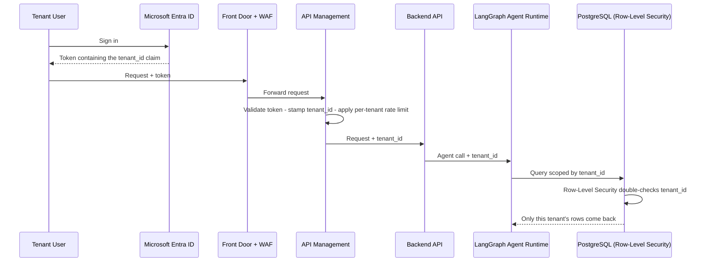
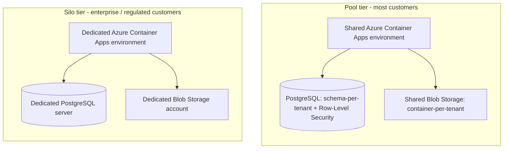
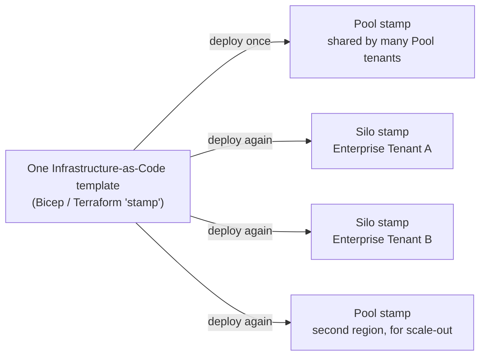
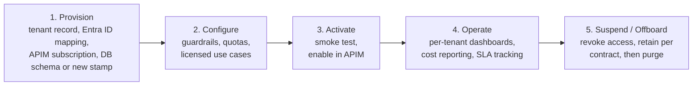
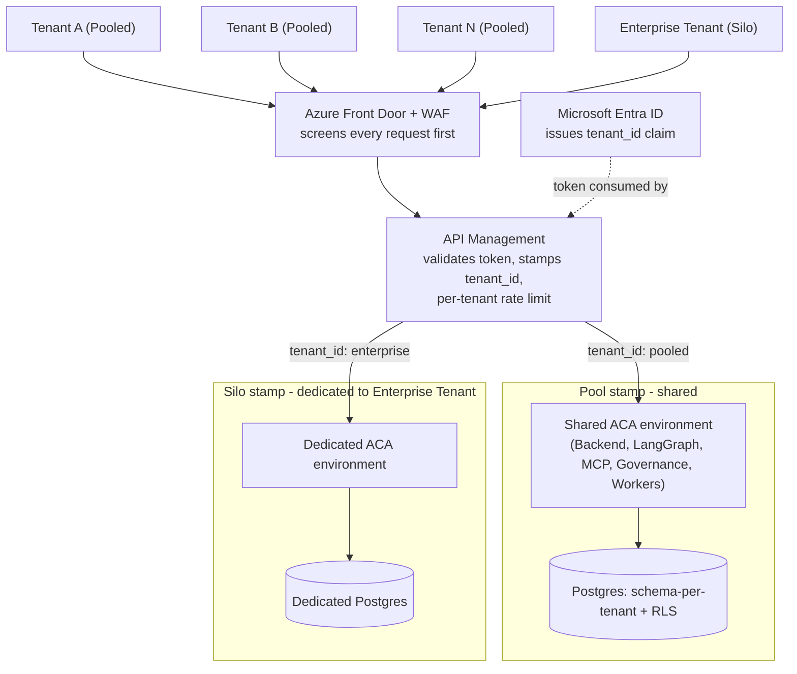
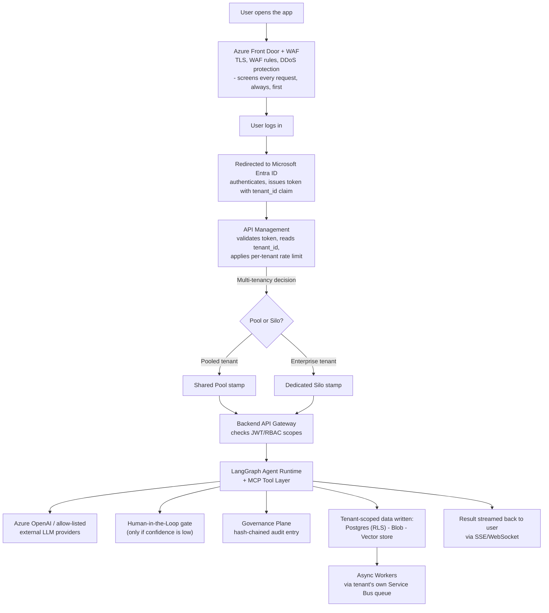

# 07 — Multi-Tenancy Explained (Presenter Reference)

One page, everything you need to explain multi-tenancy out loud: why `tenant_id` exists,
how a "Deployment Stamp" works, how Pool vs. Silo actually run, and the diagrams to point
at while you talk.

## The 30-second version

Every request that enters the platform carries a **tenant_id** — a stamped-on identity
tag — from the moment a user logs in until the moment a database row is read. Most
customers **share** the same running application ("Pool"); a few large customers get
their **own dedicated copy** of the same application ("Silo"). Both are built from the
**same reusable blueprint** (a "Deployment Stamp"), so supporting one more Pool customer
or one more Silo customer never means designing something new — it means running the
same blueprint again or adding one more row to a registry.

## 1. Why `tenant_id` — the wristband analogy

Think of a shared building with many tenants living in it. Everyone uses the same front
door, the same lifts, the same building staff — but everyone wears a **wristband** that
says which apartment they belong to. Every door, every service request, every delivery
checks the wristband before doing anything. That wristband is `tenant_id`.

- It's issued **once**, at sign-in, by Microsoft Entra ID (as a claim inside the user's token).
- It's carried on **every single hop** after that — gateway, backend, AI agent, tool call,
  database query — nobody re-derives it or guesses it later.
- It's checked **twice** at the data layer: once by the application code, and once more by
  the database itself (Row-Level Security), so a bug in application code alone can't leak
  another tenant's data.

**If someone asks "what if the application code has a bug and forgets to filter by
tenant?"** — that's exactly why Row-Level Security exists at the database itself: even if
the application "forgot," the database refuses to return rows that don't match the
caller's `tenant_id`. Two independent checks, not one.

## 2. Pool vs. Silo — who shares what

| | Pool (most customers) | Silo (large / regulated customers) |
|---|---|---|
| Compute | **Shared** Azure Container Apps environment | **Dedicated** Azure Container Apps environment |
| Database | **Shared** PostgreSQL server, one schema per tenant + Row-Level Security | **Dedicated** PostgreSQL server |
| Blob storage | **Shared** storage account, one container per tenant | **Dedicated** storage account |
| Secrets | Shared Key Vault (per environment) | Dedicated Key Vault |
| Cost | Lowest per tenant, fastest to onboard | Higher cost, sold as a premium/compliance tier |

**If someone asks "why not just give everyone their own environment, it's simpler?"** —
cost. A dedicated environment per customer is the most isolated option but the most
expensive to run and slowest to onboard; Pool is what makes the product affordable at
volume, and Silo is reserved for customers who need or pay for full isolation.

**If someone asks "why not just one shared database with no per-tenant schema at all?"**
— blast radius and defense in depth. Schema-per-tenant plus Row-Level Security means a
mistake in one tenant's data path is contained, and even a compromised application
account can't be trivially used to query across every tenant's rows at once.

## 3. What a "Deployment Stamp" actually is

A **stamp** is one repeatable, complete unit of infrastructure — defined once in code
(Bicep/Terraform) — that includes everything one tenant environment needs: the Container
Apps environment, its database, its storage, its Key Vault. It is not a metaphor for
something abstract — it is a literal template that gets **deployed again** every time a
new environment is needed.

This is why onboarding a new Silo customer is a **pipeline run**, not a bespoke
engineering project: the same template that stood up the shared Pool stamp gets run
again with different parameters, and a new, fully isolated stamp comes out the other end.
It's also why a second region for disaster recovery isn't a redesign — it's the same
stamp, deployed into a different region.

## 4. How a tenant actually gets onboarded and managed

A **Tenant Management Service** is the control-plane component that owns the tenant
registry and drives this automatically:

## 5. The whole picture in one diagram

## 6. The user journey, told as a story

This is the same architecture as above, but walked through as one continuous story you
can narrate out loud, start to finish.

1. **User opens the app, and Front Door + WAF is already in the path.** Every single
   request — even just loading the app, before anyone has logged in — passes through
   **Azure Front Door + WAF** first: TLS termination, WAF rule screening, DDoS
   protection watching in the background. This is always-on edge protection; it doesn't
   know or care yet who the user is.
2. **User logs in.** They're redirected to **Microsoft Entra ID** (outside the app's own
   edge, at Microsoft's identity platform). Entra ID checks who they are, applies
   Conditional Access (device/location/risk checks), and — the important part — issues a
   token with the **tenant_id claim baked in**. This is the moment the wristband gets put
   on. The browser is then redirected back to the app, request passing through Front
   Door + WAF again like every other request.
3. **API Management is the first place tenant identity is actually used.** APIM
   validates the token's signature, reads the `tenant_id` claim, applies **that
   tenant's** rate limit/quota, and logs the request — then decides where it goes next.
4. **Multi-tenancy branches here.** Based on `tenant_id`, APIM routes the request into
   either the **shared Pool stamp** (most customers) or that customer's **dedicated Silo
   stamp** (enterprise customers) — same request, same token, different destination.
5. **The Backend API Gateway (FastAPI) receives the request** inside whichever stamp it
   landed in, checks JWT/RBAC scopes for this specific route, and hands off to the agent
   runtime — still carrying `tenant_id`.
6. **The LangGraph Agent Runtime takes over.** It runs the appropriate agent pipeline
   (e.g., Claims Triaging), calling typed tools in the **MCP Tool Layer** — every tool
   call is checked against that tenant's permission scope before it's allowed to run.
7. **If the agent needs a model call**, it goes to **Azure OpenAI** (private endpoint,
   in-network) or, for the primary/fallback providers, out through **Azure Firewall's**
   allow-listed egress — never a raw, unfiltered path to the internet.
8. **If confidence is low, a human steps in.** The pipeline pauses at a **Human-in-the-
   Loop gate**, and a reviewer is notified before anything moves forward.
9. **Every step writes to the Governance Plane.** An audit ledger entry is appended
    (hash-chained, tamper-evident), scoped to `tenant_id`, so there's a complete record
    of exactly what happened and why.
10. **Data lands in the tenant's own space, not anyone else's.** Structured results go to
    **PostgreSQL** (that tenant's schema, Row-Level Security double-checking), files go
    to that tenant's **Blob container**, embeddings go to that tenant's **vector
    collection**.
11. **Background work happens asynchronously.** Things like RFI email dispatch are
    picked up by **Async Workers** off that tenant's own **Service Bus queue** — so a
    backlog on one tenant's jobs never delays another tenant's.
12. **The result streams back to the user in real time** over SSE/WebSocket, and shows
    up in the console with its audit trail attached.
13. **Underneath all of this, the whole time:** **Key Vault** supplied every secret via
    Managed Identity (no credentials ever in code), **Azure Monitor** collected telemetry
    from every hop, **Microsoft Purview** classified any PII involved, and **Defender for
    Cloud** watched the whole estate's posture — none of that is tenant-specific, it's
    running underneath every request, for every tenant, all the time.

## Quick answers for the room

| If they ask... | Say... |
|---|---|
| "What actually stops Tenant A seeing Tenant B's data?" | `tenant_id` scoping in every query, enforced twice: once in application code, once again by PostgreSQL Row-Level Security. |
| "What's a Deployment Stamp again?" | One infrastructure template, deployed multiple times — once for the shared Pool, once per Silo customer, once per extra region. |
| "Does adding more customers mean redesigning anything?" | No — Pool customers are a registry entry inside the existing stamp; Silo customers are the same stamp deployed again. |
| "What happens if one tenant sends a huge traffic spike?" | API Management enforces a per-tenant rate limit before it reaches shared compute, and Service Bus gives each tenant its own queue — so one tenant can't starve another. |
| "Why do some customers cost more?" | They're on the Silo tier — a fully dedicated stamp, sold as a premium/compliance option for customers who need full isolation. |

---

**Related reading:** [Multi-tenancy strategy](01-multitenancy-strategy.md) (full detail) ·
[Application architecture](02-application-architecture.md) · [Executive summary](00-executive-summary.md)
